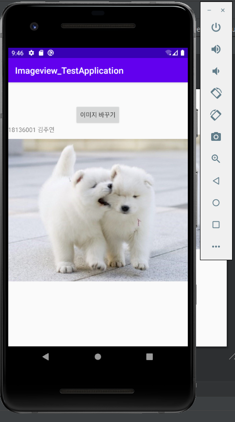
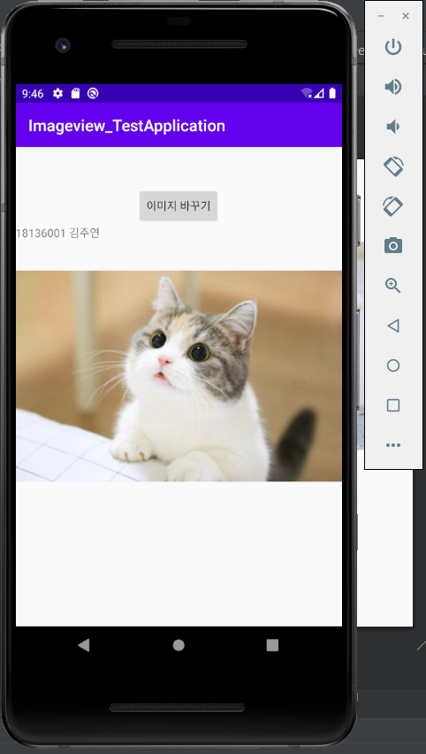

# 18136001 김주연

## 2주차 과제
</img>

## 3주차 과제
</img>

## 4주차 과제

 ○ 북적북적-독서 기록 앱(기존에 있는 앱)   
귀여운 캐릭터들과 함께  읽은 책을 기록해주는 앱   
책에 별점과 메모를 남길 수 있고, 월별로 내가 몇 권의 책을 읽었는지 히스토리에서 쉽게 볼 수 있다.   
[차별화 및 개선하여 개발하고 싶은 것]   
추가로 앱 사용자들이 읽었던 책 중에 추천하고 싶은 책을 분야별로 구분하고, 줄거리 및 간단한 후기와 함께 추천할 수 있는   
기능을 만들어 다른 사용자들도 관심있는 분야의 책을 쉽고 빠르게 확인하여 책을 더 가까이 할 수 있도록 한다. 

## 7주차 과제
</img> 
</img>

## 9주차 과제
</img> 
</img>
</img>

## 10주차 과제
</img>

## 11주차 과제
</img>
</img>
</img>

## 12주차 과제
</img>
